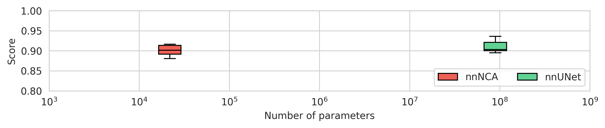

# Lifelong-nnUNet supports Neural Cellular Automata


This branch supports training of NCA models in the nnUNet autoML framework. Our NCA model achieves segmentation performance similar to the nnUNet, which is considered the state-of-the-art segmentation model, while requiring $4000\times$ fewer parameters. Configuration and training of the nnNCA models can be done using the commands
```bash
nnUNet_plan_and_preprocess_ext -t XXX
nnUNet_train_nca 3d_fullres -t XXX -f 0 -num_epoch 250 -d 0 -save_interval 25 -s seg_outputs --store_csv --nca
```
where `XXX` is the task index to train on (see [setting_up_paths.md](documentation/setting_up_paths.md) for an explanation on how to set up). Note the `--nca` argument, which is mandatory for this command.
After training, you can evaluate your model using the command
```bash
nnUNet_evaluate2 3d_fullres nnUNetTrainerNCA -trained_on XXX -f 0 -use_model XXX -evaluate_on XXX --store_csv -d 0 --fp32
```
The NCA backbone is also supported with all other models in this repository, so you can train an NCA using a continual learning algorithm. For example, you can train an elastic weight consolidation (EWC) NCA via 
```bash
nnUNet_train_ewc 3d_fullres -t 507 -f 0 -num_epoch 250 -d 0 -save_interval 25 -s seg_outputs --store_csv --nca
```

Make sure to check out our other NCA-related publications, e.g.
* [Med-NCA: Robust and Lightweight Segmentation with Neural Cellular Automata](https://arxiv.org/abs/2302.03473), Kalkhof et al.
* [M3D-NCA: Robust 3D Segmentation with Built-in Quality Control](https://arxiv.org/abs/2309.02954), Kalkhof et al.
* [MED-NCA: Bio-inspired medical image segmentation](https://www.sciencedirect.com/science/article/pii/S1361841525001483), Kalkhof et al.
* [OctreeNCA: Single-Pass 184 MP Segmentation on Consumer Hardware](https://arxiv.org/abs/2508.06993), Lemke et al.
* [Equitable Federated Learning with NCA](https://arxiv.org/abs/2506.21735), Lemke et al.


## Table Of Contents

1. [Lifelong-nnUNet](#lifelong-nnunet)
1. [Introduction](#introduction)
2. [Installation](#installation)
3. [Required Paths](#required-paths)
4. [Mapping Datasets to Other Labels](#mapping-datasets-to-other-labels)
5. [License](#license)


## Lifelong-nnUNet
This repository extends the popular [nnUNet](https://github.com/MIC-DKFZ/nnUNet) framework with methods that allow for **safer on-the-wild use**. This includes functionality for **continual learning** and **out-of-distribution detection**. With only one line of code, you can now train a model sequentially with different datasets.


You can monitor the performance throughout the training process, as illustrated below for the task of hippocampus segmentation, and output continual learning metrics such as *backward* and *forward transfer*.


The supported nnUNet version is specified in the [requirements.txt](requirements.txt) file. Please note that, at times, files are replicated from this version and adapted as needed. If you wish to use a newer nnUNet version, please make sure that all adapted files are consistent with that version. For the current `continual_learning` branch, this does not apply, ie. no files are replicated.


## Introduction

This branch currently includes the following methods for Continual Learning:
* Sequential Training
* Rehearsal Training
* Riemannian Walk
* Elastic Weight Consolidation
* Learning Without Forgetting
* Modeling the Background
* Pseudo-labeling and LOcal Pod

All other methods have been used for experiments and are not further discussed since the name should be self explanatory, for instance:
* Elastic Weight Consolidation only applied on LayerNorm layers of the Vision Transformer ([ewc_ln](/nnunet_ext/training/network_training/ewc_ln/nnUNetTrainerEWCLN.py))
* Elastic Weight Consolidation only applied on nnU-Net layers ([ewc_unet](/nnunet_ext/training/network_training/ewc_unet/nnUNetTrainerEWCUNet.py))
* Elastic Weight Consolidation only applied on Vision Transformer layers ([ewc_vit](/nnunet_ext/training/network_training/ewc_vit/nnUNetTrainerEWCViT.py))
* Sequential Training while freezing all parameters except the LayerNorm parameters from the Vision Transformer after the successfull training of the first task ([frozen_nonln](/nnunet_ext/training/network_training/Frozen_nonln/nnUNetTrainerFrozenNonLN.py))
* Sequential Training while freezing all parameters from the Vision Transformer after the successfull training of the first task ([frozen_vit](/nnunet_ext/training/network_training/frozen_vit/nnUNetTrainerFrozenViT.py))
* Sequential Training while freezing all parameters from the nnU-Net after the successfull training of the first task ([frozen_unet](/nnunet_ext/training/network_training/frozen_unet/nnUNetTrainerFrozenUNet.py))

Note that all those just described trainers are not further described in the [documentations](documentation/continual_learning.md). Further, all those trainers can only be used with the [Generic_ViT_UNet](https://github.com/camgbus/Lifelong-nnUNet/blob/continual_learning/nnunet_ext/network_architecture/generic_ViT_UNet.py#L14) architecture instead of the classic [Generic_UNet](https://github.com/MIC-DKFZ/nnUNet/blob/master/nnunet/network_architecture/generic_UNet.py#L167) architecture, so the `--use_vit` and all corresponding ViT related arguments have to be set or the training will fail.


For instructions on how to run these please see [here](documentation/continual_learning.md).


## Installation

The simplest way to install all dependencies is by using [Anaconda](https://conda.io/projects/conda/en/latest/index.html):

1. Create a Python 3.9 environment as `conda create -n <your_conda_env> python=3.9` and activate it as `conda activate  <your_conda_env>`.
2. Install CUDA and PyTorch through conda with the command specified by [PyTorch](https://pytorch.org/). The command for Linux was at the time `conda install pytorch torchvision cudatoolkit=11.3 -c pytorch`. At least PyTorch version 1.6 is required, and the code was last tested with version 1.9. Pytorch and TorchVision versions can be specified during the installation as `conda install pytorch==<X.X.X> torchvision==<X.X.X> cudatoolkit=<X.X> -c pytorch`. Note that the cudatoolkit version should be of the same major version as the CUDA version installed on the machine, e.g. when using CUDA 11.x one should install a cudatoolkit 11.x version, but not a cudatoolkit 10.x version.
3. Navigate to the project root (where `setup.py` lives).
4. Execute `pip install -r requirements.txt` to install all required packages. With this step, the [original nnUNet](https://github.com/MIC-DKFZ/nnUNet) will be installed as well, so all commands described there will work. Please note that the nnUNet commit to install is specified in requirements.txt, the code may not work for other versions of the nnUNet.
5. Set your paths as described [here](documentation/setting_up_paths.md). You should set [these](#required-paths) paths.
6. Execute `pytest` to ensure that everything is working. All tests should work, however multiple tests specifically use at least one GPU. Please refer to [this file](documentation/pytest_informations.md) for more information.


## Required Paths

Following environment variables must be set for all Lifelong-nnUNet branches:

* nnUNet_raw_data_base
* nnUNet_preprocessed
* RESULTS_FOLDER
* EVALUATION_FOLDER

Refer to [this file](documentation/setting_up_paths.md) for a description of how to set these.

## Benchmark results

In our preprint [Lifelong nnUNet: a framework for standardized medical continual learning](https://www.researchsquare.com/article/rs-1582100/v1), we summarize benchmark results for three medical imaging use cases: segmentation of the prostate and hippocampus on MRIs and of pulmonary embolism in chest CTs.


## Mapping Datasets to Other Labels

In certain cases you may wish to change the meaning of certain labels or merge different labels in order to harmonize label structures between datasets. Please refer to [this file](documentation/change_mask_labels.md) for instructions on how to do this.


## Citations
If you are using Lifelong-nnUNet for your article, please cite the following paper:
```
@article{gonzalez2023lifelong,
  title={Lifelong nnU-Net: a framework for standardized medical continual learning},
  author={Gonz{\'a}lez, Camila and Ranem, Amin and Pinto dos Santos, Daniel and Othman, Ahmed and Mukhopadhyay, Anirban},
  journal={Scientific Reports},
  volume={13},
  number={1},
  pages={9381},
  year={2023},
  publisher={Nature Publishing Group UK London}
}
```

## License

[Apache License 2.0](https://choosealicense.com/licenses/apache-2.0/)
