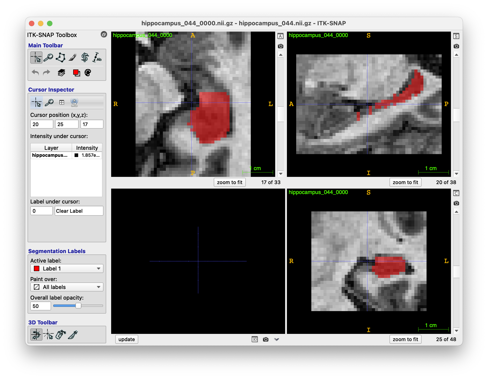

# Change mask labels for dataset given a mapping file

This is a general description on how to change the masks of a desired dataset based on a provided mapping file using the nnU-Net extension.

1. The extension can only be used after it has been succesfully installed *-- including all dependencies --* following the instructions from [here](https://github.com/camgbus/nnUNet_extensions/blob/continual_learning/README.md#installation). Further, all relevant paths have to be set, so the nnU-Net and the nnU-Net extension can extract the right directories for training, preprocessing, storing etc. as described [here](https://github.com/MIC-DKFZ/nnUNet/blob/master/documentation/setting_up_paths.md).

2. The desired dataset for which the mask labels should be transformed needs to be located under the specified `nnUNet_raw_data_base` that has been set in the previous step. It is very important to know, that the dataset needs to have a Decathlon-like structure, ie. the name starts with `Task_XX`, whereas `XX` is a desired ID and the following structure should apply:

	    nnUNet_raw_data_base/TaskXX_<dataset_name>/
	        ├── dataset.json
	        ├── imagesTr
	        │   ├── <dataset_name>_<img_nr>_0000.nii.gz
	        │   ├── ...
	        ├── (imagesTs)
	        │   ├── <dataset_name>_<img_nr>_0000.nii.gz
	        │   ├── ...
	        ├── labelsTr
	        │   ├── <dataset_name>_<img_nr>.nii.gz
	        │   ├── ...

	Note that the `dataset.json` is crucial for this functionality, since the original label mappings should be/are  defined in there. Additionally, the task ID needs to be unique, otherwise there will be an error during training, when the nnU-Net implementation tries to map a provided Task ID to its Task name -- so always provide distinct Task IDs. For simplicity let's assume we want to change the labels for the Hippocampus dataset. The Dataset has already the desired structure, so nothing needs to be changed there:

		nnUNet_raw_data_base/Task04_Hippocampus/
		├── dataset.json
		        ├── imagesTr
		        │   ├── hippocampus_001_0000.nii.gz
		        │   ├── ...
		        ├── (imagesTs)
		        │   ├── hippocampus_002_0000.nii.gz
		        │   ├── ...
		        ├── labelsTr
		        │   ├── hippocampus_001.nii.gz
		        │   ├── ...

3. In a next step, the mapping `.json` file needs to be created. The location of this file is irrelevant, as long as the algorithm has permission to follow the path and access the file under the provided path. The most straight forward way is to create a mappings folder in `nnUNet_raw_data_base/mappings`, where all the mappings are stored. Every mappings file must be in the JSON format and must have the following structure:
	```
	{
		"old_label_description --> old_label": new_label,
	}
	```
	Let's assume in our Hippocampus example, we want to change the label in such a way, that the posterior region will have the label 1. In the `dataset.json` located at `nnUNet_raw_data_base/Task04_Hippocampus/dataset.json` one can see, that the current labels are the following:
	```
	{	
		...,
		"labels":	{
					"0": "background",
					"1": "Anterior",
					"2": "Posterior"
				},
		...
	}
	```
	With this information we can simply build the new mapping in `hippocampus_mapping.json` as follows:
	```
	{
		"Posterior --> 2": 1,
	}
	```
	
	Note, that everything which is not listed in this `hippocampus_mapping.json` file, for instance the anterior region, will have the label 0 thus be classified as background. Assuming the mappings folder is located in the `nnUNet_raw_data_base/`, the path to the hippocampus mapping file would be the following: `nnUNet_raw_data_base/mappings/hippocampus_mapping.json`

4. Finally the new masks can be generated by executing the following command. Note that the ID provided under `-t_out` needs to be unique in order to avoid possible side effects or errors during the training when using this generated task:
	```bash
		  ~ $ source ~/.bashrc
		  ~ $ source activate <your_anaconda_env>
	(<your_anaconda_env>) $ nnUNet_dataset_label_mapping -t_in nnUNet_raw_data_base/Task04_Hippocampus 
							     -t_out 41
							     -m nnUNet_raw_data_base/mappings/hippocampus_mapping.json
	```
After successful termination of the algorithm, the new task/dataset with ID 41 can be found at `nnUNet_raw_data_base/ nnUNet_raw_data/Task041_Hippocampus` and the corresponding preprocessed dataset is located under `nnUNet_preprocessed/ Task041_Hippocampus`. In both locations, the `dataset.json` has been updated and includes the new label mapping in the standard way. The original Task, ie. `nnUNet_raw_data_base/Task04_Hippocampus` still exists and includes the original dataset and corresponding masks.

The following images show the different masks where the difference can be observed:

<p align="center">
	,
	
</p>

As we have seen, the Anterior region *-- that was previouly red --* is now not visible, ie. background, whereas the Posterior region *-- that was previouly green --* is now red and represents a new label internally.

In the following, the possible command line arguments are presented and further discussed.

### Command Line Arguments
The following arguments and flags can be set to use this extension:

| Tag_name | description | required | choices | default | 
|:-:|-|:-:|:-:|:-:|
| `-t_in` or `--tasks_in_path` | Specify one or a list of paths to tasks TaskXX_TASKNAME folders. | yes | -- | -- |
| `-t_out` or `--tasks_out_path` | Specify the *unique* task ids for the output folders. | yes | -- | -- |
| `-m` or `--mapping_files_path` | Specify one or a list of paths to the mapping (.json) files corresponding to the task ids. | yes | -- | -- |
| `-p` | Use this to specify how many processes are used to run the script | no | -- | `default_num_threads` from nnunet/configuration.py |
| `--no_pp` or `--disable_plan_ preprocess_tasks` | Set this if the plan and preprocessing step for each task using nnUNet_plan_and_preprocess should not be performed after a transformation. | -- | -- | `False` |
| `-h` or `--help` | Simply shows help on which arguments can and should be used. | -- | -- | -- |

When talking about lists in command lines, this does not mean to provide a real list, like values in bracket *--* `[.., .., ...]`  *--*, but rather dies it mean to provide an enumeration of values *--* `val_1 val2 val3 ...` *--*.

For instance, the general command for changing the labels in a mask of multiple datasets with multiple mappings  looks like the following:

```bash
          ~ $ source ~/.bashrc
          ~ $ source activate <your_anaconda_env>
(<your_anaconda_env>) $ nnUNet_dataset_label_mapping -t_in <path_1> <path_2> ... <path_n> 
						     -t_out <ID_1> <ID_2> ... <ID_n> 
						     -m <mapping_1> <mapping_2> ... <mapping_n> 
						    [-p <number> --no_pp]
```

If `--no_pp` or `--disable_plan_ preprocess_task` is not set, the function will run the nnU-Nets pipeline configuration and preprocessing using the 
```bash
nnUNet_plan_and_preprocess -t <task_id_from_task_out>
```
command. After that, the dataset can directly be used for training either a conventional nnU-Net or a provided extension of the nnU-Net.
