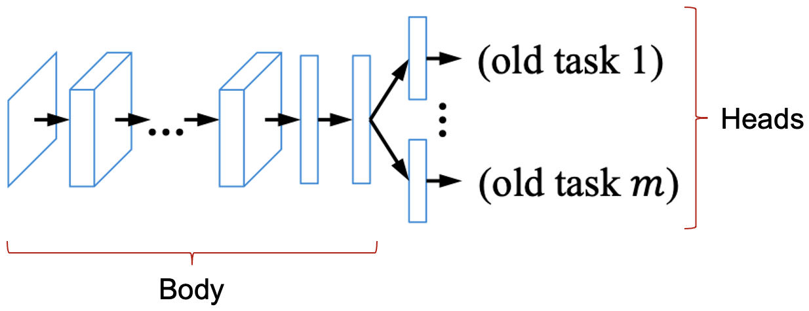
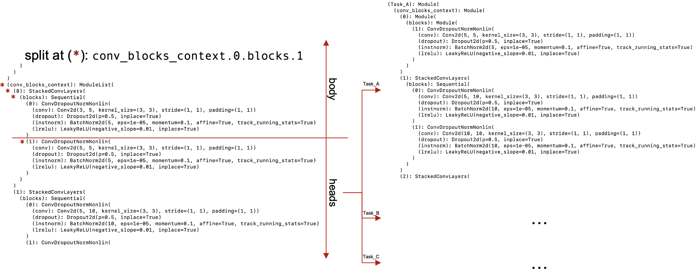

# nnU-Net Continual Learning extension: Multi-Head Architecture

This is a general description on how to use the Multi-Head Architecture that enables the training on a stream of datasets resulting in task specific heads. The idea is to use either a pre-trained or freshly initialized -- given the provided arguments -- `Generic_UNet` and split the network into a shared body and task specific head. Whenever the network is trained on a new dataset, a new head will be added and trained correspondingly. The implementation can be found [here](https://github.com/camgbus/Lifelong-nnUNet/blob/continual_learning/nnunet_ext/network_architecture/MultiHead_Module.py).

In the following, the module will be further discussed. Note that the module was developed in such a way that it is not limited to the use of a `Generic_UNet` since any network inheriting `nn.Module` can be used to be split.

### Initialize a Multi-Head Network
For the initialization of a Multi-Head Network, the following arguments have to be provided:
*   *class_object*: This is the class (network) that should be used, i.e. that will be split. This needs to be a class inheriting `nn.Module`, where the `.forward()` method is implemented, since this will be used as well.
*   *split_at*: The path in the network where the split should be performed. Use the dot notation ('.') to specify the path to a desired split point. Note that the specified path is the very first element in the head, i.e. not included in the shared body.
*   *task*: The name of the first head. Since this function will perform a split, the splitted part needs to have a name; this specifies it.
*   *prev_trainer*: If the split should be performed on a previously trained/existing model, than this can be provided with this variable. Note: The type needs be equal to the provided *class_object*.
*   *&ast;args* and *&ast;&ast;kwargs*: Provide all further positional and keyword arguments that are necessary to initialize the *class_object*. Note: This needs to be done correctly, since if it is not, *class_object* has missing/too much positional arguments and will fail during runtime in initialization. This is only necessary when *prev_trainer* is not provided or None.

For instance, a general command for creating a Multi-Head Network out of a `Generic_UNet`, splitting at the *seg\_outputs* level without using a pre-trained network would look like the following:

```python
from nnunet.network_architecture.generic_UNet import Generic_UNet
from nnunet_ext.network_architecture.MultiHead_Module import MultiHead_Module 

config_args = { ... }
mh_network = MultiHead_Module(Generic_UNet, split_at = 'seg_outputs', task = 'Task_A', prev_trainer = None, **config_args)
```

If a pre-trained network should be used, than the corresponding code snippets would look like the following:

```python
from nnunet.network_architecture.generic_UNet import Generic_UNet
from nnunet_ext.network_architecture.MultiHead_Module import MultiHead_Module 

model = torch.load(...) # Load some pre-trained network of type Generic_UNet
mh_network = MultiHead_Module(Generic_UNet, split_at = 'seg_outputs', task = 'Task_A', prev_trainer = model)
```

### Overall Multi-Head Architecture
As mentioned in the beginning, the Multi-Head Network consists of a shared body and task specific heads. The easiest way to describe the Architecture is visually (image extracted from [here](https://arxiv.org/pdf/1606.09282.pdf) and modified accordingly):

<p align="center">
    
</p>

### How to define the split path
As previously mentioned, the split path needs to be provided in form of a dot notation ('.'). In the examples so far, no deeper path has been specified. However the depth of a path is not restricted and one might even split the network on a ReLU layer e.g. As long as the path exists in the Network and does not lead to the very first element in the Network, any path can be used, a more complex example would be the following *-- out of simplicity a pre-trained network is used here --*:

```python
from nnunet.network_architecture.generic_UNet import Generic_UNet
from nnunet_ext.network_architecture.MultiHead_Module import MultiHead_Module 

model = torch.load(...) # Load some pre-trained network of type Generic_UNet
mh_network = MultiHead_Module(Generic_UNet, split_at = 'conv_blocks_context.0.blocks.1', task = 'Task_A', prev_trainer = model)
```

The following image shows how the split is performed on a sample network:

<p align="center">
    
</p>

Keep in mind that we implemented a path optimizer which removes all blank spaces, but also shortens the path to the barest minimum in such a way, that the computational complexity is reduced. A very drastic example *-- based on the image --* would be the split path `conv_blocks_context.0.blocks.0.conv` which can be easily reduced to the simple `conv_blocks_context` path thus reducing (computational wise) the recursion depth from 4 to 0.

### How assemble a model
The assembly of the shared body with a specific head is provided through the `assemble_model(...)` function. When using this function, the head to assemble the body with needs to be specified its name. Further, one can specify if the body needs to be frozen or not. This will be very helpful when implementing methods like the LwF Trainer, where a training part is specifically performed with freezed body parameters that are not updated during training. The following example shows how to assemble a model using the shared body and the head called *Task\_A* with a freezed body:

```python
from nnunet.network_architecture.generic_UNet import Generic_UNet
from nnunet_ext.network_architecture.MultiHead_Module import MultiHead_Module 

model = torch.load(...) # Load some pre-trained network of type Generic_UNet
mh_network = MultiHead_Module(Generic_UNet, split_at = 'conv_blocks_context.0.blocks.1', task = 'Task_A', prev_trainer = model)
task_a_model = mh_network.assemble_model(task = 'Task_A', freeze_body = True)
```

If the body should not be freezed, then the flag `freeze\_body` can be set to False.


### Adding a new head
A new head can be easily introduced by using the provided `add_new_task(...)` function. For this, one has to specify the name of the task as well as the initialization type. This means whether the previous head should be used as the initialization of the new head or not. If not, then the very first head from the initial split will be used as initialization. This is important to know, especially if a pre-trained network is used. In such a case, the head will not be randomly initialized but with the head that results from the initial split (which is at this point task specific so to say since its a pre-trained network). The following shows an example where the previous head *Task\_A* is used as the initialization of the new head *Task\_B*:

```python
from nnunet.network_architecture.generic_UNet import Generic_UNet
from nnunet_ext.network_architecture.MultiHead_Module import MultiHead_Module 

model = torch.load(...) # Load some pre-trained network of type Generic_UNet
mh_network = MultiHead_Module(Generic_UNet, split_at = 'conv_blocks_context.0.blocks.1', task = 'Task_A', prev_trainer = model)
mh_network.add_new_task(task = 'Task_A', use_init = False, model = None)
```

Note that it is also possible to provide ones own specific PyTorch model if a completely new head should be introduced. For this, the `model` flag should be used while providing the model that should be used as the head instead of setting the flag to None.

### Further Informations
For the presented Multi-Head Architecture, an extensive PyTest has been developed and can be found [here](https://github.com/camgbus/Lifelong-nnUNet/blob/continual_learning/test/network_architecture/test_MultiHead_Module.py). Since the module is a general implementation and rather complex than simple, especially the splitting and assembling process, one should always make sure that the Module performs as expected before actually using it, especially when using a very deep split path.
Additional functions that are not covered in this documentation can be found in the actual implementation, along with extensive descriptions and comments, [see here](https://github.com/camgbus/Lifelong-nnUNet/blob/continual_learning/nnunet_ext/network_architecture/MultiHead_Module.py).
